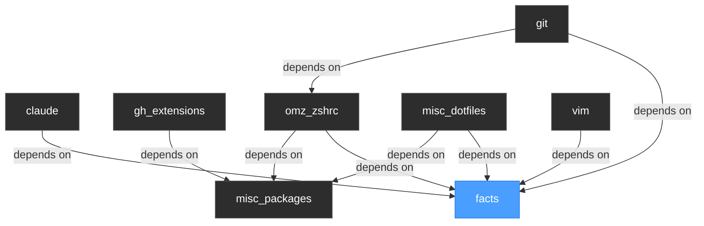

```mermaid
graph TD

    claude -->|depends on| facts
    facts
    gh_extensions -->|depends on| misc_packages
    git -->|depends on| facts
    git -->|depends on| omz_zshrc
    misc_dotfiles -->|depends on| facts
    misc_dotfiles -->|depends on| misc_packages
    misc_packages
    omz_zshrc -->|depends on| facts
    omz_zshrc -->|depends on| misc_packages
    vim -->|depends on| facts

    classDef facts fill:#4a9eff,stroke:#2b7de9,color:#fff
    classDef role fill:#2d2d2d,stroke:#555,color:#fff
    classDef default fill:#2d2d2d,stroke:#555,color:#fff
    class facts facts
```
